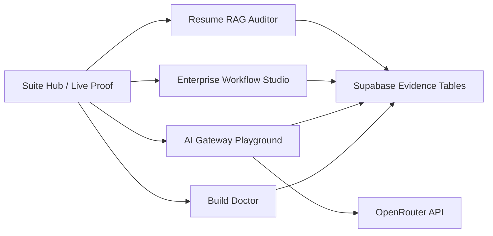

# ZRT Vercel AI Systems Suite — Reviewer Packet

## 30-Second Summary

ZRT Vercel AI Systems Suite is a production-deployed set of four connected Next.js/Vercel apps demonstrating applied AI engineering: build failure diagnosis, AI gateway failover, enterprise-safe agent workflow design, and evidence-grounded resume claim auditing.

The suite is intentionally honest about mode:

- Production-deployed on Vercel.
- Deterministic demo behavior works without paid provider keys.
- Supabase evidence tables are provisioned.
- OpenRouter is supported behind `OPENROUTER_API_KEY`.
- Missing credentials degrade to explicit fallback mode instead of pretending to be live.

## Live URLs

| Surface | URL |
|---|---|
| Suite Hub | https://vercel-build-doctor-agent.vercel.app |
| Build Doctor Tool | https://vercel-build-doctor-agent.vercel.app/build-doctor |
| Build Doctor Case Study | https://vercel-build-doctor-agent.vercel.app/case-study |
| Enterprise Agent Workflow Studio | https://enterprise-agent-workflow-studio.vercel.app |
| AI Gateway Failover Playground | https://ai-gateway-failover-playground.vercel.app |
| Resume Evidence RAG Auditor | https://resume-evidence-rag-auditor.vercel.app |
| GitHub Profile | https://github.com/zrt219 |

## Screenshots

| Surface | File |
|---|---|
| Suite Hub | `screenshots/suite-hub.png` |
| Build Doctor | `screenshots/build-doctor.png` |
| AI Gateway | `screenshots/ai-gateway.png` |
| Enterprise Studio | `screenshots/enterprise-studio.png` |
| Resume Auditor | `screenshots/resume-auditor.png` |

## What Each App Proves

| App | Engineering Proof |
|---|---|
| Vercel Build Doctor Agent | Log ingestion, secret redaction, failure taxonomy, evidence extraction, fix plans, report generation, eval discipline. |
| AI Gateway Failover Playground | Provider-routing concepts, cost/latency budgets, outage fallback, circuit-breaker traces, OpenRouter live path with fallback. |
| Enterprise Agent Workflow Studio | Tool registry modeling, approval-gated agent graphs, risk scoring, data classification, audit exports. |
| Resume Evidence RAG Auditor | Evidence retrieval over local corpus, claim verification, unsupported-claim flagging, grounded bullet generation. |

## Architecture

## Integration Proof

| Check | Route |
|---|---|
| Build Doctor health | `/api/health` |
| Build Doctor integration | `/api/integration-health` |
| Enterprise integration | `https://enterprise-agent-workflow-studio.vercel.app/api/integration-health` |
| Gateway integration | `https://ai-gateway-failover-playground.vercel.app/api/integration-health` |
| Resume Auditor integration | `https://resume-evidence-rag-auditor.vercel.app/api/integration-health` |

Supabase schema was applied to project `gajpnqqfkjtmqdnufbcf` with:

- `suite_events`
- `demo_runs`
- `eval_runs`
- `exported_reports`

The schema is also stored in `supabase/schema.sql`.

Verified Supabase readiness:

- Project `gajpnqqfkjtmqdnufbcf` is reachable through the Supabase connector.
- Evidence tables are present with RLS enabled.
- Release hardening removed public integration probe write routes; `/api/integration-health` is read-only.

## Eval Results

| App | Eval Coverage |
|---|---|
| Build Doctor | 8 build-failure fixtures |
| AI Gateway | 5 routing and budget fixtures |
| Enterprise Studio | 4 approval-policy fixtures |
| Resume Auditor | 4 grounding and safety fixtures |

## Premium Audit Handoff

| Artifact | Purpose |
|---|---|
| `SECURITY_AUDIT_HANDOFF.md` | Reviewer-facing security and release-candidate handoff summary. |
| `audit-results/summary.json` | Machine-readable 45,000-check audit total, pass/fail counts, and verdict. |
| `audit-results/failures.json` | Failure list; expected to be empty when the audit passes. |
| `audit-results/coverage-by-app.json` | Per-app and per-category coverage counts. |

Latest local deterministic audit target: 45,000 checks, positioned as engineering-review evidence rather than production security certification.

## OpenAI-Focused Pitch

This suite demonstrates coding-agent-adjacent product engineering: failure analysis, structured outputs, tool-use planning, deterministic fallback, eval loops, and evidence-based reporting. Build Doctor is the strongest OpenAI Codex signal because it converts raw failure logs into a structured diagnosis, patch checklist, verification commands, and incident report.

## Anthropic-Focused Pitch

This suite demonstrates customer-facing applied AI workflow design: safety labels, approval gates, redaction, unsupported-claim flagging, fallback behavior, and auditability. Enterprise Agent Workflow Studio and Resume Evidence RAG Auditor are the strongest Anthropic signals because they emphasize safe tool use and evidence-grounded outputs.

## Limitations

- This is not a full SaaS platform: no user accounts, billing, or production observability stack.
- Supabase runtime mode requires Vercel env vars before deployed apps can persist evidence events through explicitly designed server routes.
- OpenRouter live mode requires `OPENROUTER_API_KEY`; otherwise AI Gateway returns deterministic fallback output.
- Any OpenRouter key exposed outside Vercel environment settings should be rotated before live use.
- A public exact GitHub repo URL is still pending because this local environment has no `gh` CLI and the available GitHub connector exposes file operations for existing repos, not repository creation.

## Resume Bullets

- Built a connected Vercel AI Systems Suite across four deployed Next.js apps, unifying build diagnosis, AI gateway failover, enterprise agent workflow design, and resume evidence auditing into a reviewer-ready demo with health/eval proof links.
- Added integration-health surfaces and Supabase-ready evidence persistence contracts with deterministic fallback behavior, giving reviewers a secret-safe view into deployment and integration readiness.
- Implemented an OpenRouter-backed AI Gateway route with mock fallback, request tracing, cost/latency policy simulation, and deterministic eval coverage for provider-routing behavior.
- Built a deterministic 45,000-check audit harness for the four-app Vercel AI suite, covering log diagnosis, provider failover, enterprise workflow safety, resume-evidence grounding, API contracts, and secret-redaction controls with generated handoff artifacts.

## Final Reviewer Checklist

- Open the suite hub.
- Click each app tile and confirm it loads.
- Open each app’s health, eval, and integration-health route.
- In AI Gateway, run `/api/chat` with and without OpenRouter configured.
- Confirm no response exposes raw secrets.
- Review `SECURITY_AUDIT_HANDOFF.md` and `audit-results/summary.json`.
- Review `supabase/schema.sql`, tests, and deployment smoke evidence in `ai-engineering/daily-engineering-log.md`.
